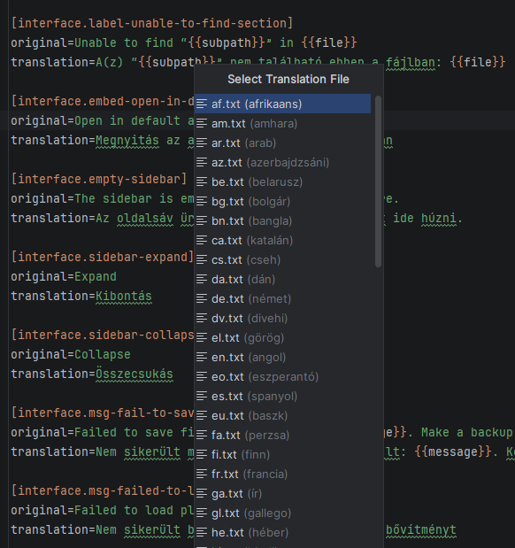
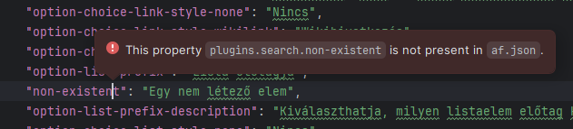
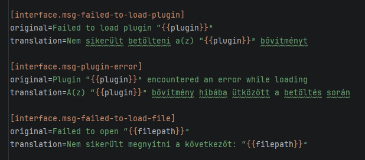
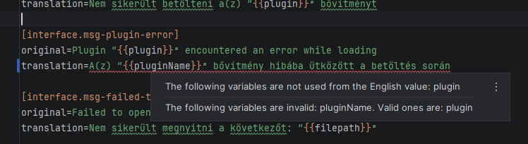
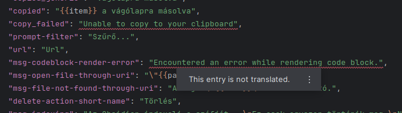
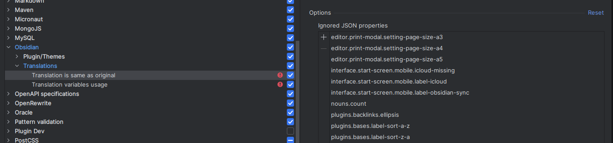
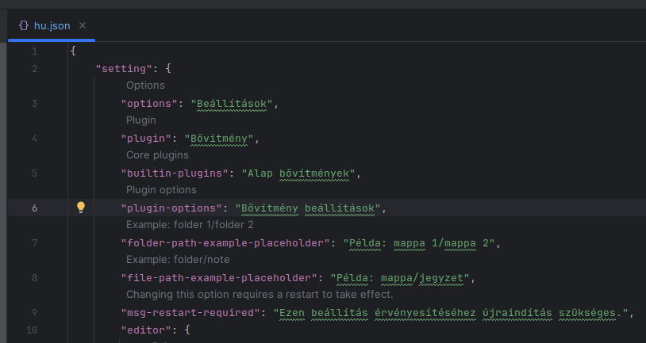

# Obsidian Ecosystem - Plugin for JetBrains IDEs

<!-- Plugin description -->
This JetBrains IDE plugin provides various features for those that work with [Obsidian.md](https://obsidian.md)'s
translations.

The plugin is not released on the JetBrains Marketplace or on any other outlet. Its main purpose is to demonstrate
that such small aspects of an ecosystem like translations can have meaningful IDE integrations, even if it is for a
small number of contributors. However, the plugin is functional, so feel free to use it for actual Obsidian translation
activities. You can download the plugin archive from the [download](download/obsidian-ecosystem-0.1.0.zip) directory.
<!-- Plugin description end -->

----

<!-- TOC -->
* [Translations](#translations)
  * [Show translation of property in another language](#show-translation-of-property-in-another-language)
  * [Generate property in en.json into all other translation files](#generate-property-in-enjson-into-all-other-translation-files)
  * [Delete property from all translations](#delete-property-from-all-translations)
  * [Variable annotations](#variable-annotations)
  * [Variable usage inspections](#variable-usage-inspections)
  * [Untranslated entries](#untranslated-entries)
  * [Display original values inline](#display-original-values-inline)
<!-- TOC -->

## Translations

The features described in this document are all created for the [obsidian-translations](https://github.com/obsidianmd/obsidian-translations/) project.

### Show translation of property in another language

This intention action, available on leaf JSON properties, lets users navigate to the translation of the selected property in other languages.

It presents the user the list of available translation files, and if the property is available in the file selected, the IDE opens the file
and navigates to that property.

The language names displayed inside parenthesis are their localized versions.



If the property is not present in the target file, an error message is shown.



### Generate property in en.json into all other translation files

When a new property is added in `en.json` because of for example new feature development, it is good practice
(or is even required for proper functioning) to add that property into other translation files with its English value.

To simplify this process, this intention action can be invoked on any leaf JSON property with a String value in `en.json`,
that will generate this property into all other translation files.

If the selected property is already present in a translation file but with a different value, this intention doesn't update that value.

For example, if you invoke the intention on `newProperty` here:

```json
{
  "setting": {
    "options": "Options",
    "editor": {
      "newProperty": "value",
      "name": "Editor"
    }
  }
}
```

the Hungarian translation (and of course all others) will be updated from

```json
{
  "setting": {
    "options": "Beállítások",
    "editor": {
      "name": "Szerkesztő"
    }
  }
}
```

to

```json
{
  "setting": {
    "options": "Beállítások",
    "editor": {
      "newProperty": "value",
      "name": "Szerkesztő"
    }
  }
}
```

### Delete property from all translations

During feature developments, cleanups, etc. localization keys may be removed from the application, thus in order to speed up that process,
this intention action can be invoked on any leaf JSON property with a String value in `en.json`,
and it will delete that property from all available translation files.

For example, if you invoke the intention on `section-behavior` here:

```json
{
  "setting": {
    "options": "Options",
    "editor": {
      "name": "Editor",
      "section-behavior": "Behavior"
    }
  }
}
```

it will remove that property from all translation files like this:

```json
{
  "setting": {
    "options": "Options",
    "editor": {
      "name": "Editor"
    }
  }
}
```

### Variable annotations

In order to make `{{...}}` variables stand out in translation strings, this annotator applies styling to them.



### Variable usage inspections

This inspection reports the following issues with `{{...}}` variables:
- **missing variable**: one or more variables present in the English value, are not used in a translation
- **invalid variable**: one or more variables are specified with names that are not present in the English value

**NOTE**: This inspection assumes that the variables are used by their names in Obsidian's code base, and not by index
or by other means.



### Untranslated entries

This inspection reports localization properties that are untranslated, i.e. have the same value as their original,
English counterparts. This can aid translators to identify entries that are not yet translated.



In the inspections settings there is a customizable list of JSON paths to ignore entries that doesn't need translation,
like abbreviations, or are not allowed to be translated, like brand names.

The feature comes with a default set of such ignored entries but one can remove or add any for language specific configuration.



### Display original values inline

An inlay hint is available in non-en.json files that displays the original, English values above all entries.

This is an aid both during the creation of new translations and the maintenance of existing ones, but probably more for the latter.
The translation file and en.json don't have to be open next to each other to compare strings, instead they appear inline.

This feature is disabled by default, and can be enabled under Settings > Editor > Inlay Hints > Values > JSON.



There are entries that start and/or end with whitespaces. The inlay hint texts of those are enclosed by '' characters, so that the enclosing
whitespace characters become more prominent.
