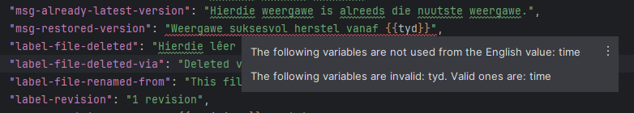

# Obsidian Ecosystem - Plugin for JetBrains IDEs

<!-- Plugin description -->
This JetBrains IDE plugin provides various features for those that work with [Obsidian.md](https://obsidian.md)'s
translations (mainly this area) and plugin/theme development.

The plugin is not released on the JetBrains Marketplace or on any other outlet. It's main purpose is to demonstrate
that such small aspects of an ecosystem like translations can have meaningful IDE integrations, even if it is for a
small number of contributors. However, the plugin is functional, so feel free to use it for actual Obsidian translation
activities. You can download the plugin archive from the [download](download/obsidian-ecosystem-0.1.0.zip) directory.
<!-- Plugin description end -->

----

<!-- TOC -->
* [Translations](#translations)
    * [Show translation of property in another language](#show-translation-of-property-in-another-language)
    * [Generate property in en.json into all other translation files](#generate-property-in-enjson-into-all-other-translation-files)
    * [Delete property from all translations](#delete-property-from-all-translations)
    * [Variable annotations](#variable-annotations)
    * [Variable usage inspections](#variable-usage-inspections)
* [Plugins and Themes](#plugins-and-themes)
    * [JSON schema for manifest.json](#json-schema-for-manifestjson)
    * [manifest.json issues](#manifestjson-issues)
    * [Completion of lucide.dev icons](#completion-of-lucidedev-icons)
    * [Reporting command ids prefixed with the plugin id](#reporting-command-ids-prefixed-with-the-plugin-id)
<!-- TOC -->

## Translations

The features described in this document are all created for the [obsidian-translations](https://github.com/obsidianmd/obsidian-translations/) project.

### Show translation of property in another language

This intention action, available on leaf JSON properties, lets users navigate to the translation of the selected property in other languages.

It presents the user the list of available translation files, and if the property is available in the file selected, the IDE opens the file
and navigates to that property.

The language names displayed inside parenthesis are their localized versions.


If the property is not present in the target file, an error message is shown.


### Generate property in en.json into all other translation files

When a new property is added in `en.json` because of for example new feature development, it is good practice
(or is even required for proper functioning) to add that property into other translation files with its English value.

To simplify this process, this intention action can be invoked on any leaf JSON property with a String value in `en.json`,
that will generate this property into all other translation files.

If the selected property is already present in a translation file but with a different value, this intention doesn't update that value.

For example, if you invoke the intention on `newProperty` here:

```json
{
  "setting": {
    "options": "Options",
    "editor": {
      "newProperty": "value",
      "name": "Editor"
    }
  }
}
```

the Hungarian translation (and of course all others) will be updated from

```json
{
  "setting": {
    "options": "Beállítások",
    "editor": {
      "name": "Szerkesztő"
    }
  }
}
```

to

```json
{
  "setting": {
    "options": "Beállítások",
    "editor": {
      "newProperty": "value",
      "name": "Szerkesztő"
    }
  }
}
```

### Delete property from all translations

During feature developments, cleanups, etc. localization keys may be removed from the application, thus in order to speed up that process,
this intention action can be invoked on any leaf JSON property with a String value in `en.json`,
and it will delete that property from all available translation files.

For example, if you invoke the intention on `section-behavior` here:

```json
{
  "setting": {
    "options": "Options",
    "editor": {
      "name": "Editor",
      "section-behavior": "Behavior"
    }
  }
}
```

it will remove that property from all translation files like this:

```json
{
  "setting": {
    "options": "Options",
    "editor": {
      "name": "Editor"
    }
  }
}
```

### Variable annotations

In order to make `{{...}}` variables stand out in translation strings, this annotator applies styling to them.


### Variable usage inspections

This inspection reports the following issues with `{{...}}` variables:
- **missing variable**: one or more variables present in the English value, are not used in a translation
- **invalid variable**: one or more variables are specified with names that are not present in the English value

**NOTE**: This inspection assumes that the variables are used by their names in Obsidian's code base, and not by index
or by other means.



----

## Plugins and Themes

### JSON schema for manifest.json

Since the `manifest.json` has various properties depending on the type of Obsidian plugin project, with different required states,
JSON schema is available for both plugins and themes that automatically provide code completion and validation.

The schemas are assigned to the `manifest.json` when the project is set as a plugin or theme project in the IDE settings
under <kbd>Settings</kbd> > <kbd>Tools</kbd> > <kbd>Obsidian</kbd>.


### manifest.json issues

This inspection reports the following issues in the `manifest.json` file:
- If the `description` property is longer than 250 characters.
- If the `description` property doesn't end with a dot.
- If the name of the project root directory doesn't match the `name` property.

### Completion of lucide.dev icons

This code completion provides names of lucide.dev icons in the arguments of `setIcon()` and `addRibbonIcon()` function calls.

Based on the Obsidian [Icons](https://docs.obsidian.md/Plugins/User+interface/Icons) documentation, the names are provided only up to lucide v0.292.0.


### Reporting command ids prefixed with the plugin id

An inspection takes care of reporting command ids in `Plugin.addCommand()` function calls that are prefixed with
the plugin id. According to the
[Submission requirements for plugins](https://docs.obsidian.md/Plugins/Releasing/Submission+requirements+for+plugins#Don't%20include%20the%20plugin%20ID%20in%20the%20command%20ID)
page it is done automatically.


